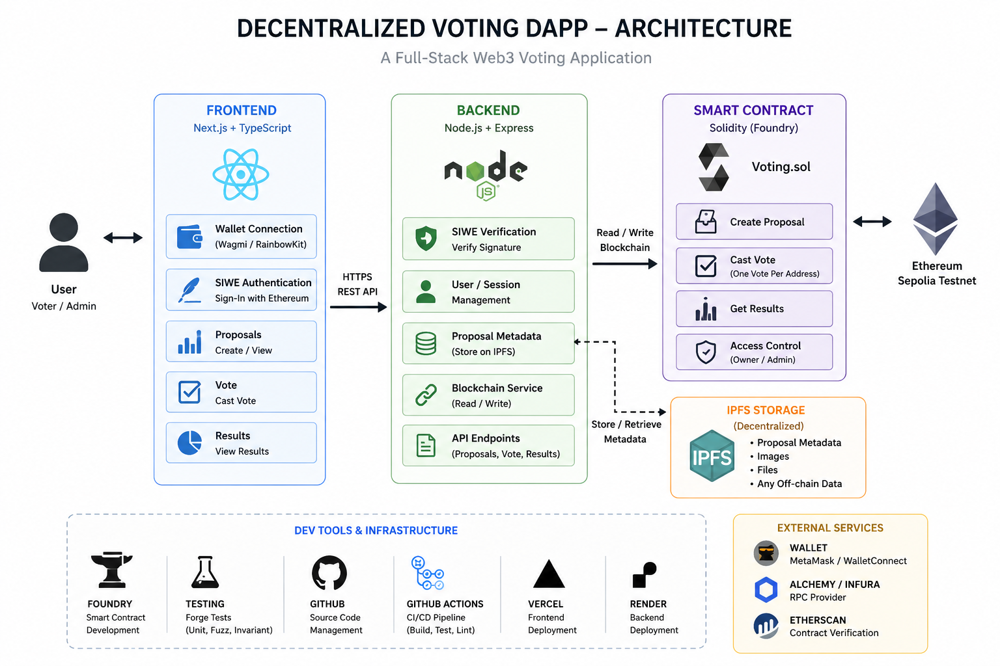
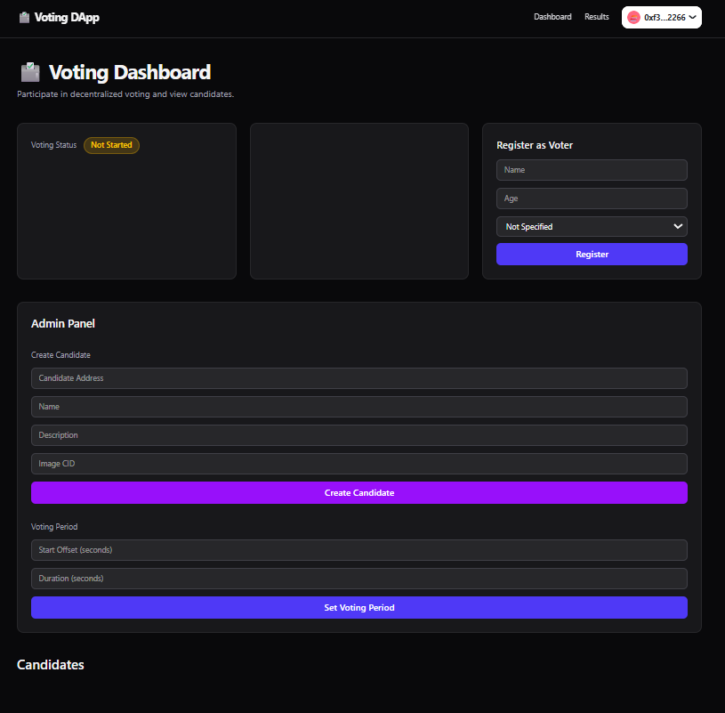

# Decentralized Voting DApp

A full-stack decentralized voting application built using Solidity, Foundry, TypeScript, SIWE authentication, and IPFS storage.

**Status:**Currently configured for local development using Anvil. The project is fully functional in a local environment. Deployment to the Ethereum Sepolia testnet is planned.

---

## Overview

This project demonstrates a secure blockchain-based voting system where users authenticate with Ethereum wallets, create proposals, and cast votes on-chain.

The application uses:

- Smart contracts for transparent voting logic
- SIWE (Sign-In with Ethereum) for authentication
- IPFS for decentralized metadata storage
- Foundry for contract development/testing
- TypeScript-based frontend and backend

---

## Features

- Wallet-based authentication using SIWE
- Create voting proposals
- Cast secure on-chain votes
- Prevent double voting
- IPFS metadata storage
- Foundry smart contract testing
- Type-safe frontend/backend architecture

---

## Tech Stack

### Smart Contracts
- Solidity
- Foundry
- OpenZeppelin

### Frontend
- Next.js
- TypeScript
- TailwindCSS
- Wagmi
- RainbowKit

### Backend
- Node.js
- Express
- SIWE Authentication

### Storage
- IPFS

### Blockchain
- Ethereum
- Anvil local development

---

## Project Structure

```txt
.
├── contracts/
├── frontend/
├── backend/
├── docs/
└── README.md
```

---

## Architecture



---

## Screenshots

### Admin Dashboard



### Voting Interface


### Results Dashboard


---

## Smart Contract Highlights

- Gas-optimized Solidity patterns
- Custom error handling
- Event emission for indexing
- Access control implementation
- Foundry-based unit testing

---

## Local Development Setup

### 1. Clone Repository

```bash
git clone https://github.com/YOUR_USERNAME/voting-dapp.git
cd voting-dapp
```

---

### 2. Start Local Blockchain

```bash
anvil
```

---

### 3. Deploy Smart Contracts

```bash
cd contracts
forge install
forge build
forge script script/Deploy.s.sol --broadcast
```

---

### 4. Start Backend

```bash
cd backend
npm install
npm run dev
```

---

### 5. Start Frontend

```bash
cd frontend
npm install
npm run dev
```

---

## Environment Variables

Create `.env` files using the provided `.env.example` templates.

Example:

```env
RPC_URL=http://127.0.0.1:8545
PRIVATE_KEY=
NEXT_PUBLIC_CONTRACT_ADDRESS=
```

---

## Testing

### Smart Contract Tests

```bash
cd contracts
forge test -vvv
```

---

## Future Improvements

- Deploy contracts to Sepolia
- DAO governance integration
- Snapshot-based off-chain voting
- zk-proof anonymous voting
- Subgraph indexing

---

## License

MIT License